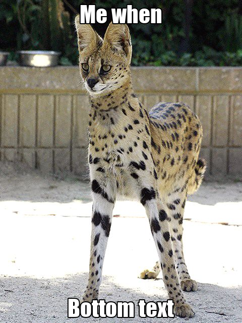

# ttbt
Command-line 'Top Text Bottom Text' meme generator, written in python. Intended to use for shitposting on short notice. Or something like that.

## Features:
- Uses Impact font with stroke
- Supports line-wrapping
- Reads in .jpg, .png, or .gif images

## Usage:
Either run the file directly, or add to your system PATH. 

To add to your system path on linux, copy the file to /usr/bin, remove .py, and add the following line to the top of the file:
```
#!/usr/bin/env python
```
Also make sure to change the font import to point to the absolute location of the impact.ttf file. Done!

## Example:

Input: `ttbt image.jpg -t "Me when" -b "Bottom text"`

Output:



## Deps:
- Python 3.9
- click >= 8.0.3
- Pillow >= 8.4.0
